# Code-Challenge-01-JS-Fundamentals

## Objects

Objects consist of properties, which are used to describe an object. The values of object properties can either contain primitive data types or other objects.

### Passing Object Basics Tests
All completed.
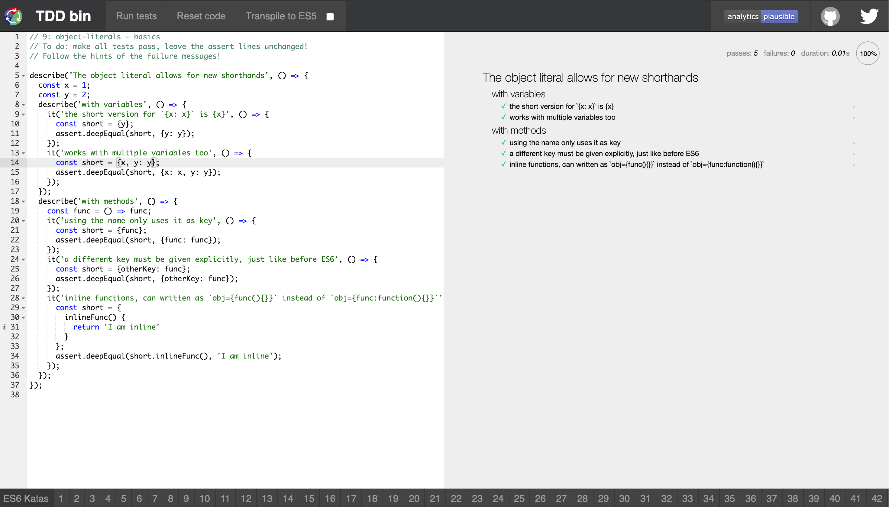

### Passing Object Computed Properties Tests
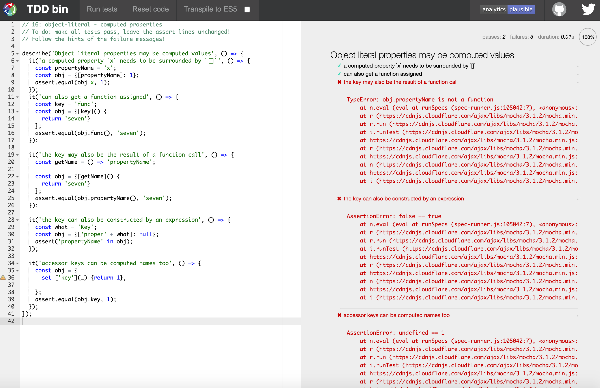

## Classes

Classes are "special functions," and just as you can definte function expressions and function declarations, the class syntax has two components: class expressionsa nd class declarations.

### Passing Classes Creation Tests

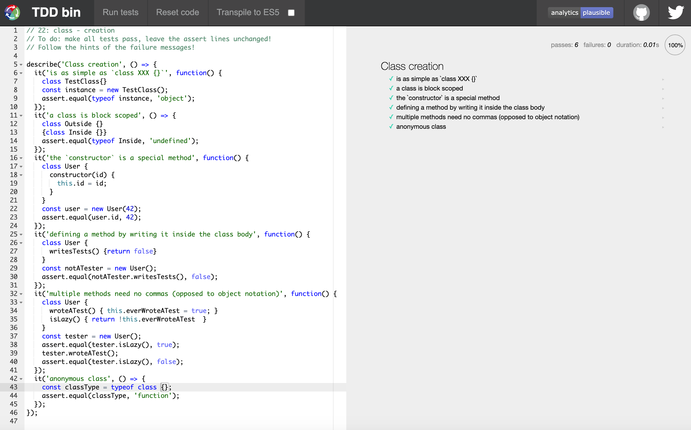

### Passing Classes Statics Tests

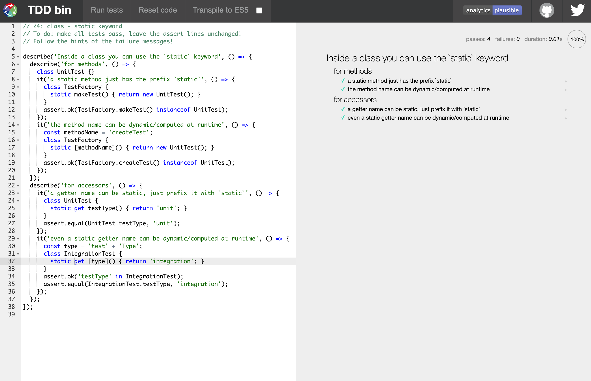

### Passing Classes Extends Tests

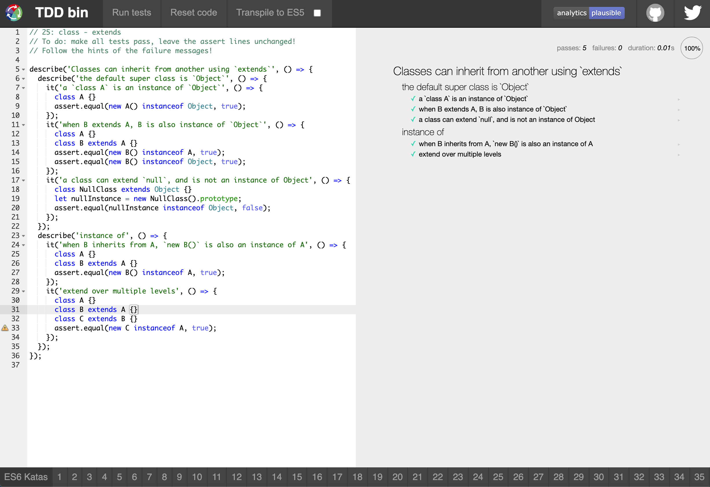

## Destructuring

Destructuring assignment syntax is a JavaScript expression that makes it possible to unpack arrays, or properties from objects, into distinct variables.

### Passing Array Destructuring Tests
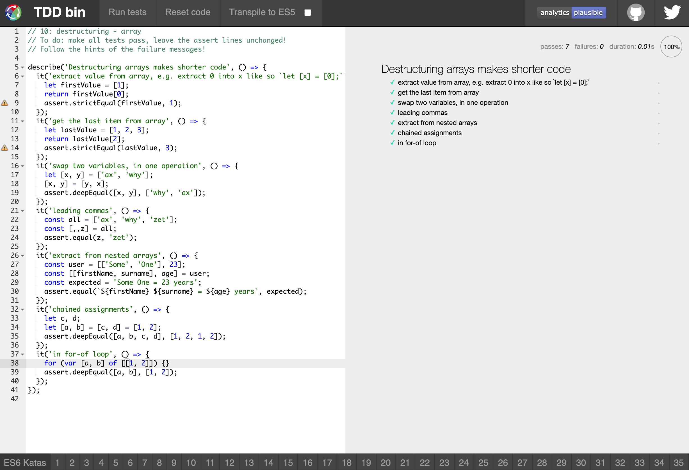

### Passing String Destructuring Tests
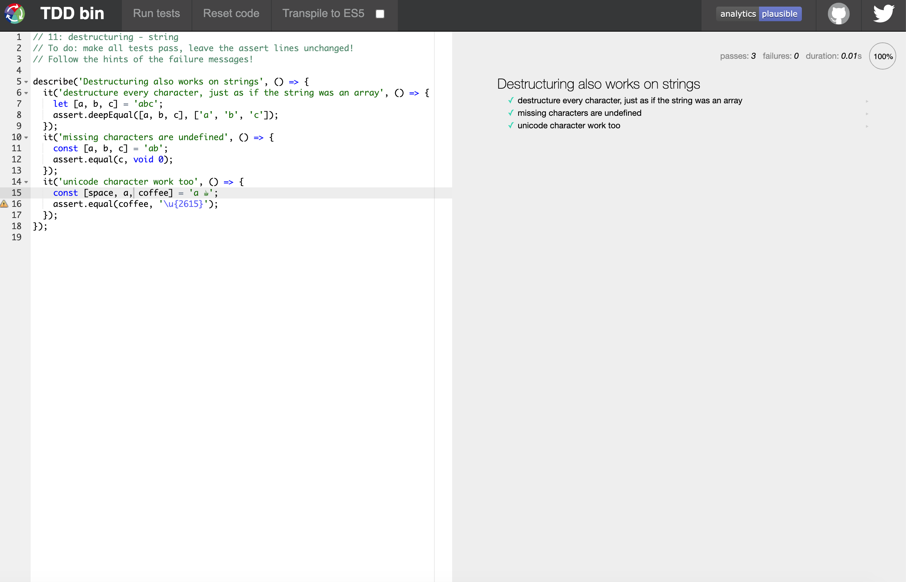

### Passing Object Destructuring Tests
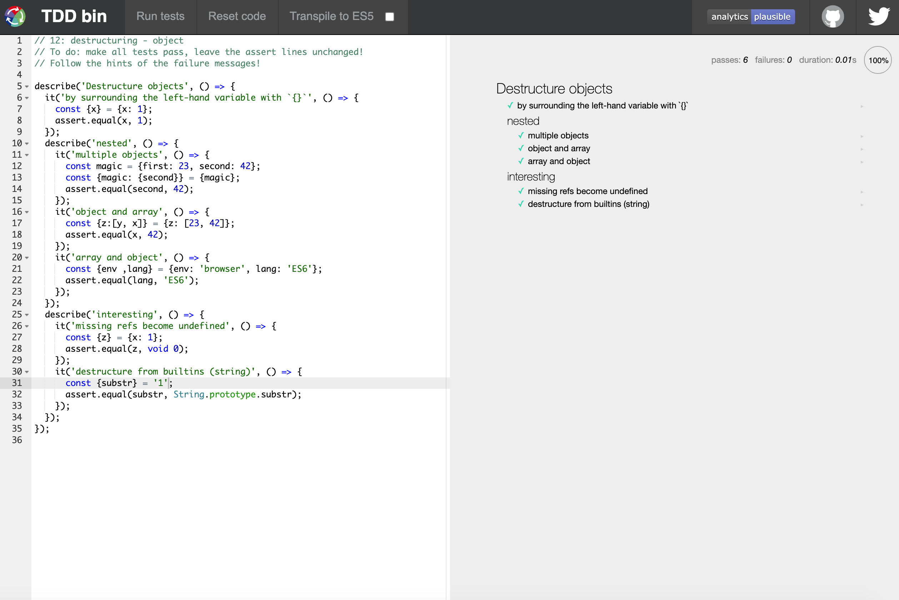

### Passing Destructuring with Defaults Tests
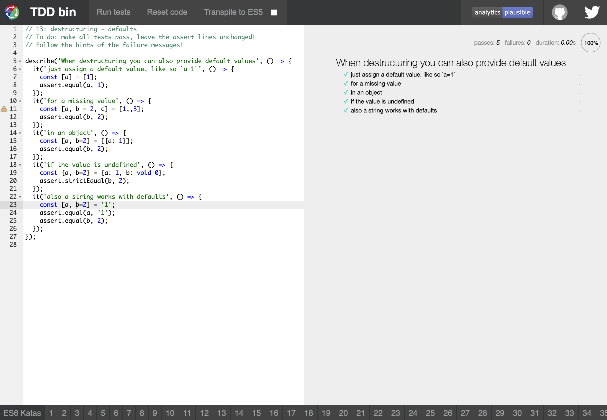

### Passing Destructuring Function Parameters Tests
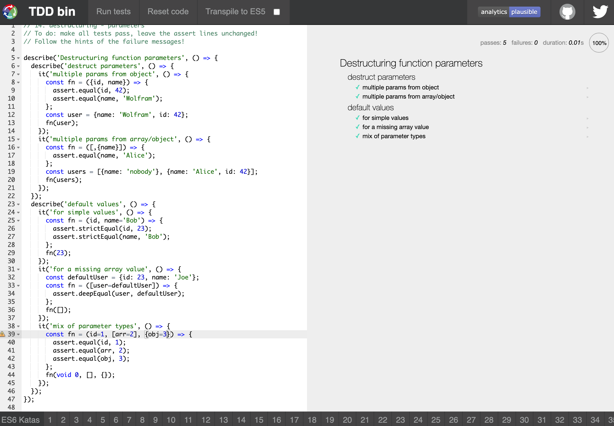

### Passing Destructuring with Alias Tests
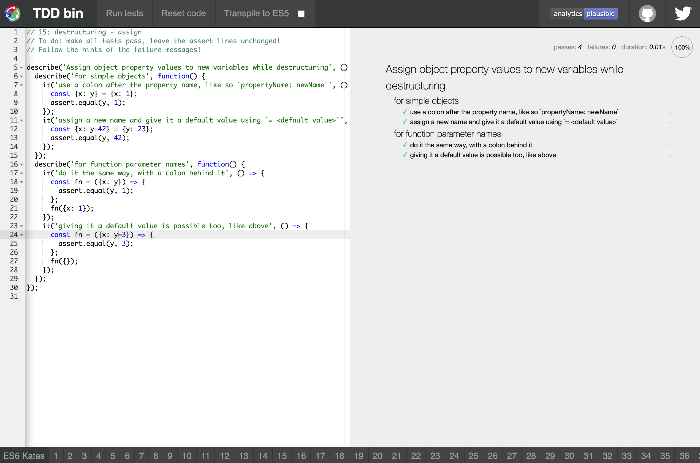

## Rest

The rest parameter syntax allows us to represent an indefinite number of arguments as an array.

### Passing Rest as a Parameter Tests
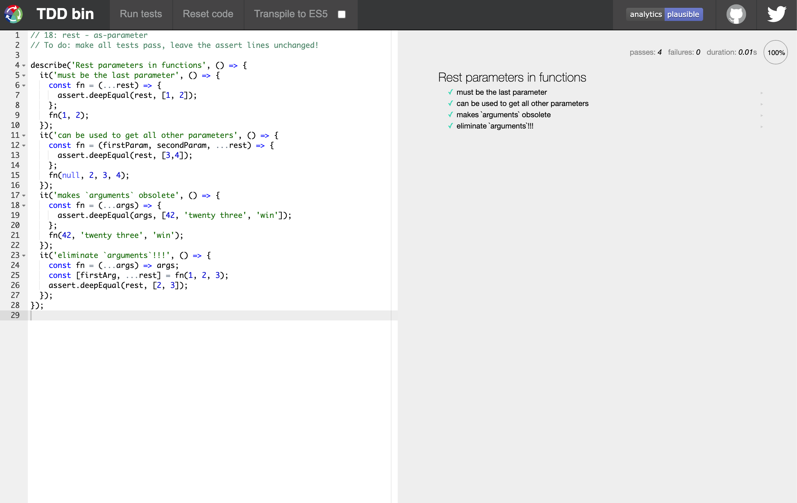

### Passing Rest while Destructuring Tests
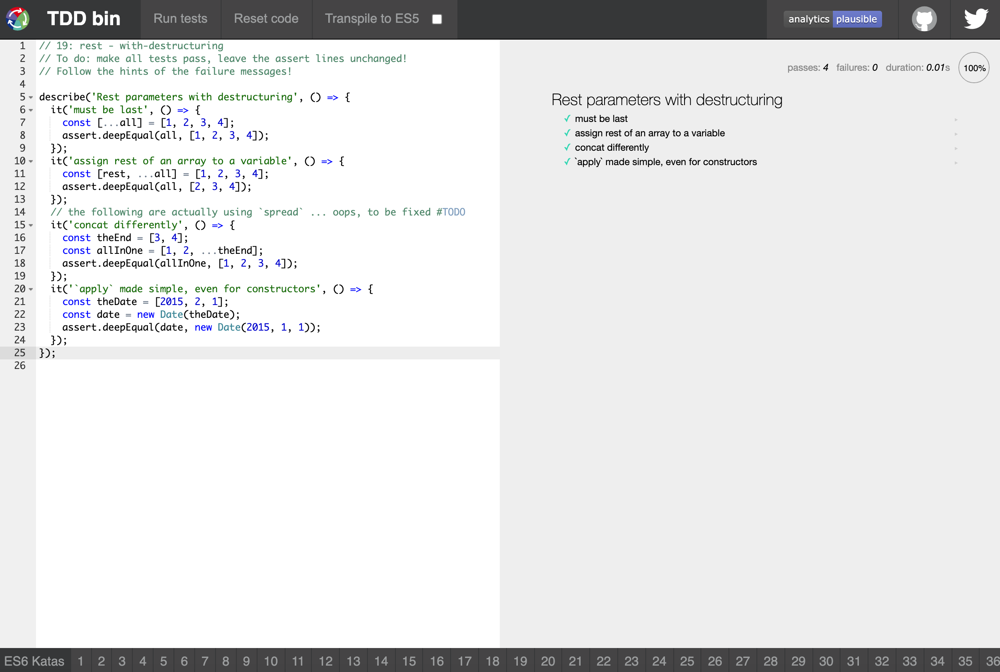

## Spread

Spread syntax allows an iterable such as an array expression or string to be expanded in places where zero or more arguments (for function calls) or elements (for array literals) are expected, or an object expression to be expanded in places where zero or more key-value pairs (for object literals) are expected.

### Passing Array Spread Tests

## Function Defaults

Default function parameters allow named parameters to be initialized with default values if no value or undefined is passed.

### Passing Function Defaults Tests
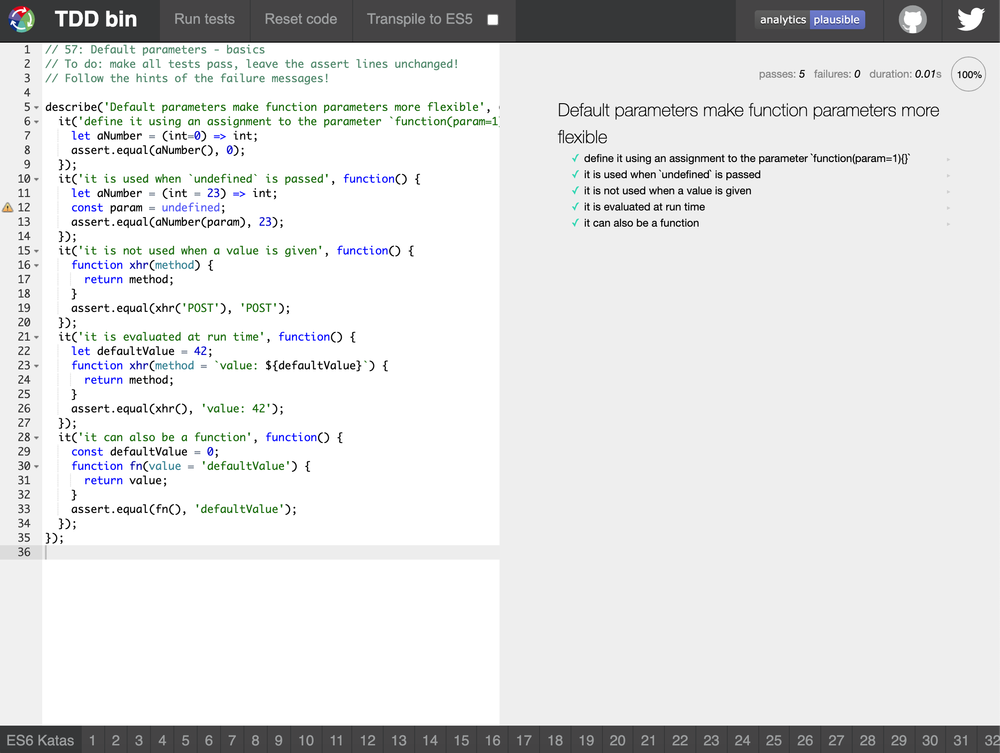