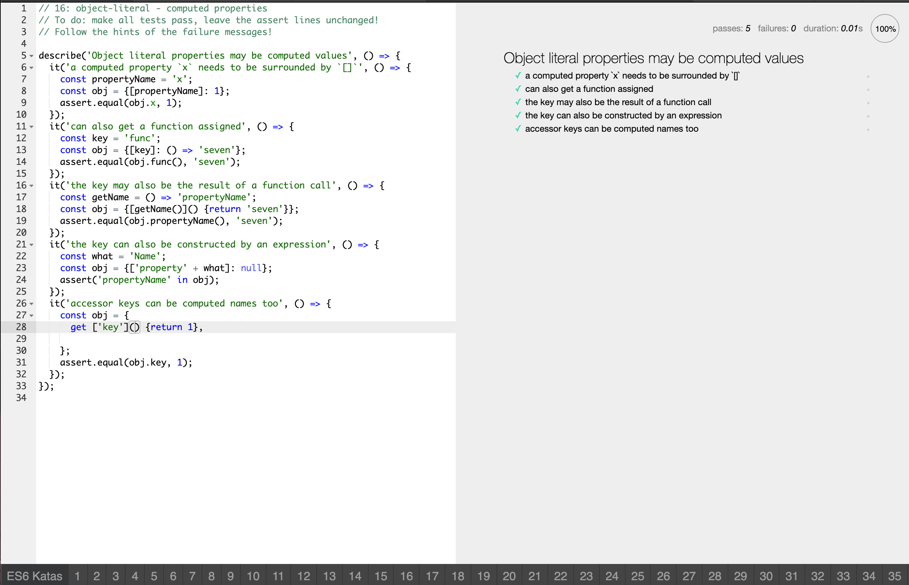

# Code-Challenge-01-JS-Fundamentals

## Objects

Objects consist of properties, which are used to describe an object. The values of object properties can either contain primitive data types or other objects.

### Passing Object Basics Tests

### Passing Object Computed Properties Tests

## Classes

Classes are "special functions," and just as you can definte function expressions and function declarations, the class syntax has two components: class expressionsa nd class declarations.

### Passing Classes Creation Tests

### Passing Classes Statics Tests

### Passing Classes Extends Tests

## Destructuring

### Passing Array Destructuring Tests

### Passing String Destructuring Tests

### Passing Object Destructuring Tests

### Passing Destructuring with Defaults Tests

### Passing Destructuring Function Parameters Tests

### Passing Destructuring with Alias Tests

## Rest

### Passing Rest as a Parameter Tests

### Passing Rest while Destructuring Tests

## Spread

### Passing Array Spread Tests

## Function Defaults

### Passing Function Defaults Tests